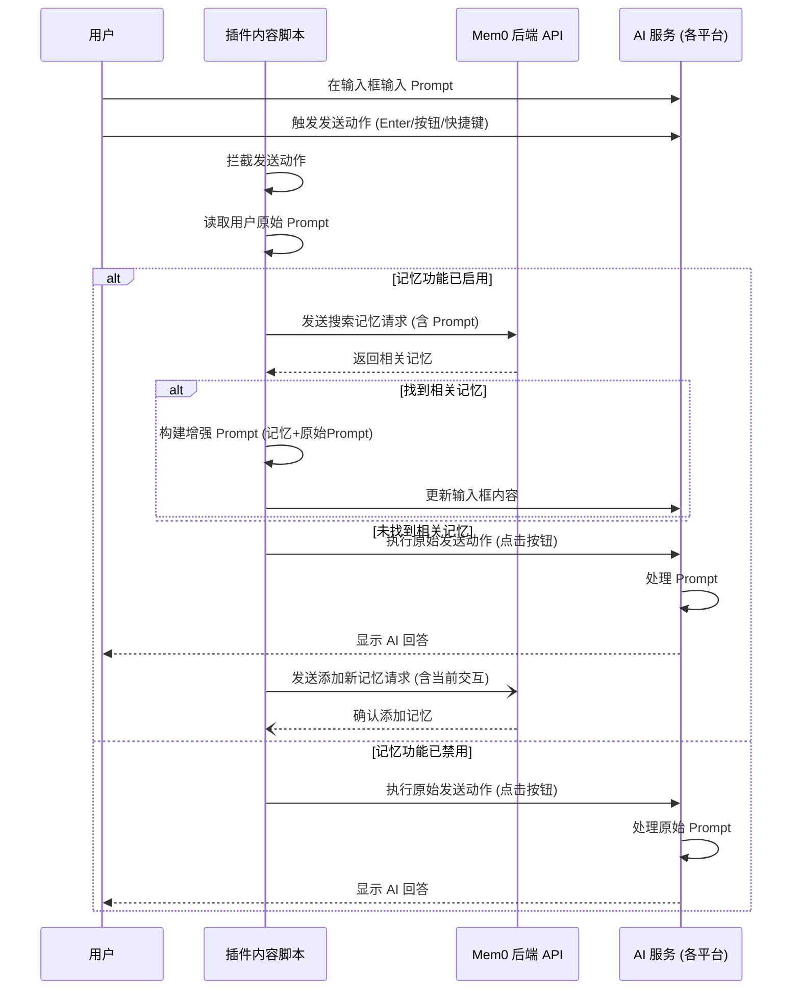

# Mem0 插件在不同 AI 平台的实现方式对比

Mem0 Chrome 插件的核心目标是在用户与不同的 AI 聊天机器人交互时，利用用户的记忆库来增强 Prompt，并保存新的交互作为记忆。虽然核心流程相似，但在不同平台（ChatGPT, Claude, Perplexity, Grok）上的具体实现会因各个平台的 UI 和 DOM 结构不同而有所差异。

## 通用流程 (Mermaid)

以下流程图展示了插件在所有支持平台上的通用工作模式：

## 各平台实现细节

### 1. ChatGPT (`chatgpt/content.js`)

*   **输入框定位**: 通过 `document.querySelector('div[contenteditable="true"]') || document.querySelector("textarea")` 来查找输入区域。
*   **发送触发**: 
    *   主要通过 `addEnterKeyInterception` 函数拦截 `Enter` 键的 `keydown` 事件。
    *   支持 `Ctrl+M` 快捷键触发 `handleMem0Click`。
*   **发送按钮**: `button[aria-label="Send prompt"]`。
*   **核心函数**: `handleMem0Click` 处理记忆检索和 Prompt 修改，`addEnterKeyInterception` 负责拦截发送。
*   **独特功能**: 
    *   在 ChatGPT 的记忆设置页面添加了 "Sync" 按钮 (`#sync-button`) 和 `handleSyncClick` 函数，用于将 ChatGPT 的原生记忆同步到 Mem0。
    *   API 调用时 `metadata.provider` 设置为 `"ChatGPT"`。

### 2. Claude (`claude/content.js`)

*   **输入框定位**: 与 ChatGPT 类似，使用 `document.querySelector('div[contenteditable="true"]') || document.querySelector("textarea")`。
*   **发送触发**: 
    *   主要通过 `Ctrl+M` 快捷键触发 `handleMem0Click`。
    *   通过 `addMem0Button` 在发送按钮旁添加了一个 Mem0 图标按钮 (`#mem0-button`)，点击该按钮也会触发 `handleMem0Click`。
    *   *注意：似乎没有直接拦截 Enter 键，主要依赖快捷键或专用按钮。*
*   **发送按钮**: `button[aria-label="Send Message"]`。
*   **核心函数**: `handleMem0Click` 处理记忆检索和 Prompt 修改。
*   **独特功能**: 
    *   添加了专用的 Mem0 图标按钮用于触发记忆检索。
    *   包含 `getLastMessages` 函数，可能用于获取最近的对话历史以辅助记忆添加。
    *   API 调用时 `metadata.provider` 设置为 `"Claude"`。

### 3. Perplexity (`perplexity/content.js`)

*   **输入框定位**: 使用较为复杂的 CSS 选择器定位 `textarea`，例如 `textarea.overflow-auto...` 或 `textarea[placeholder="Ask follow-up"]`。
*   **发送触发**: 通过 `handleEnterKey` 函数拦截 `Enter` 键的 `keydown` 事件 (需要确保不是 Shift+Enter)。
*   **发送按钮**: `button[aria-label="Submit"]`。
*   **核心函数**: `handleMem0Processing` 处理主要的记忆检索、Prompt 修改和异步记忆添加逻辑。
*   **独特功能**: 
    *   使用 `setupInputObserver` (MutationObserver) 来监听输入框值的变化。
    *   API 调用时 `metadata.provider` 设置为 `"Perplexity"`。

### 4. Grok (`grok/content.js`)

*   **输入框定位**: 通过 `document.querySelector('textarea[data-testid="compose-text-input"]')` 定位输入框。
*   **发送触发**: 与 Perplexity 类似，通过 `handleEnterKey` 拦截 `Enter` 键。
*   **发送按钮**: `button[data-testid="request-button"]`。
*   **核心函数**: `handleMem0Processing`，结构和 Perplexity 的非常相似。
*   **独特功能**: 
    *   同样使用 `setupInputObserver` 来监听输入。
    *   实现逻辑与 Perplexity 高度相似。
    *   API 调用时 `metadata.provider` 设置为 `"Grok"`。

## 实现对比总结

| 特性             | ChatGPT                                                      | Claude                                                       | Perplexity                                                                 | Grok                                                               |
| :--------------- | :----------------------------------------------------------- | :----------------------------------------------------------- | :------------------------------------------------------------------------- | :------------------------------------------------------------------------- |
| **输入框选择器** | `div[contenteditable]` 或 `textarea`                         | `div[contenteditable]` 或 `textarea`                         | 特定长类名 `textarea` 或 `[placeholder="Ask follow-up"]`                  | `textarea[data-testid="compose-text-input"]`                             |
| **发送触发**     | Enter 键拦截, `Ctrl+M`                                         | `Ctrl+M`, Mem0 图标按钮点击                                   | Enter 键拦截                                                               | Enter 键拦截                                                               |
| **发送按钮选择器** | `button[aria-label="Send prompt"]`                           | `button[aria-label="Send Message"]`                          | `button[aria-label="Submit"]`                                              | `button[data-testid="request-button"]`                                   |
| **核心处理函数** | `handleMem0Click`, `addEnterKeyInterception`                   | `handleMem0Click`                                            | `handleMem0Processing`, `handleEnterKey`                                     | `handleMem0Processing`, `handleEnterKey`                                     |
| **独特之处**     | - ChatGPT 记忆同步功能 - 无专用 Mem0 按钮                | - 添加专用 Mem0 按钮 - 可能获取对话历史                 | - 使用 MutationObserver 监听输入 - 实现与 Grok 相似                         | - 使用 MutationObserver 监听输入 - 实现与 Perplexity 相似                      |
| **Provider 标记**| `"ChatGPT"`                                                | `"Claude"`                                                 | `"Perplexity"`                                                             | `"Grok"`                                                                 |

总的来说，插件通过为每个平台编写特定的 `content.js` 脚本，利用平台独特的 DOM 结构和事件机制，实现了通用的记忆检索和 Prompt 增强功能。主要差异在于如何精确地定位输入框/发送按钮，以及如何拦截用户的发送意图。
