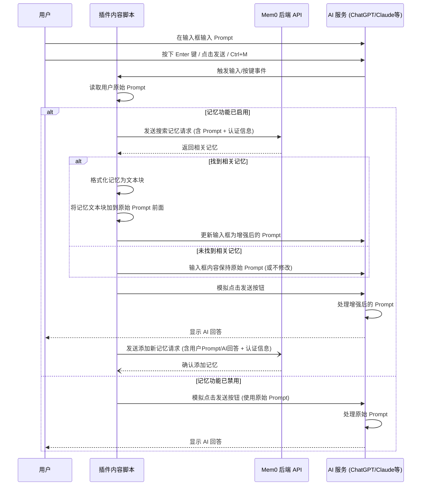

# Mem0 Chrome 插件如何修改 AI Prompt

Mem0 Chrome 插件通过在用户与支持的 AI 服务（如 ChatGPT, Claude, Perplexity, Grok）交互时，动态地将相关的个人记忆注入到用户的 Prompt 中，从而实现个性化回复。

## 核心工作流程

插件通过以下步骤，在你使用 ChatGPT、Claude、Perplexity 或 Grok 时，利用你的记忆来增强 Prompt：

1.  **监听用户输入**: 插件的 `content script` (例如 `chatgpt/content.js`, `claude/content.js` 等) 会被注入到对应的 AI 服务网页中。它会监听输入框（通常是 `textarea` 或 `div[contenteditable="true"]`）的事件，特别是当你按下 `Enter` 键准备发送消息时（或者通过 `Ctrl+M` 快捷键触发）。
2.  **检查记忆开关**: 插件会检查侧边栏（Sidebar）中的记忆开关是否处于启用状态 (`memory_enabled` 存储在 `chrome.storage.sync` 中)。如果禁用，插件将不会修改 Prompt，直接发送原始消息。
3.  **获取用户 Prompt**: 如果记忆功能启用，插件会读取你输入框中的原始 Prompt 内容。
4.  **调用 Mem0 API 搜索记忆**: 插件将你的原始 Prompt 和你的认证信息（API Key 或 Access Token）发送到 Mem0 后端 API (`https://api.mem0.ai/v1/memories/search`)。
5.  **接收相关记忆**: Mem0 API 会根据你的 Prompt 内容，搜索并返回最相关的记忆片段。
6.  **构建增强 Prompt**:
    *   如果 API 返回了相关的记忆，插件会将这些记忆格式化成一个特定的文本块，通常包含类似 "Here is some of my preferences/memories to help answer better..." 的引导语。
    *   这个记忆文本块会被添加到你的**原始 Prompt 前面**。
7.  **更新输入框**: 插件将这个增强后的 Prompt (记忆文本块 + 原始 Prompt) 写回到 AI 服务的输入框中。
8.  **发送 Prompt**: 插件会模拟点击 AI 服务原来的发送按钮，将增强后的 Prompt 发送给 AI 进行处理。
9.  **(异步) 添加新记忆**: 在发送 Prompt 的同时或之后，插件通常还会异步调用 Mem0 API (`https://api.mem0.ai/v1/memories/`) 将你当前的提问（有时也包括 AI 的回答）作为一个新的记忆点存入你的记忆库。

## 流程图 (Mermaid)

## 关键组件

*   **Content Scripts**: (`chatgpt/content.js`, `claude/content.js`, `perplexity/content.js`, `grok/content.js`) 负责直接与 AI 服务网页交互，监听事件，修改 DOM (输入框)，调用 API。
*   **Background Script**: (`background.js`) 处理插件安装、图标点击、全局消息监听等。
*   **Sidebar**: (`sidebar.js`, `sidebar.html`) 提供用户界面来查看、管理记忆和控制记忆开关。
*   **Mem0 API**: 后端服务，负责存储、搜索和管理用户记忆。
